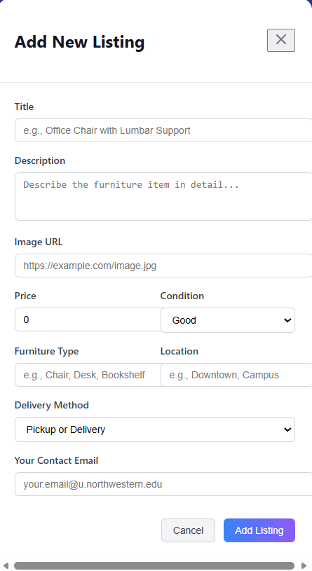

<div align="center">
  
</div>

# DormDeals

DormDeals is a student marketplace web app for buying and selling furniture. The current implementation focuses on the Marketplace experience, where users can browse listings, search for furniture, filter and sort results, inspect listing details, reveal seller contact, and create new posts.

## Current Marketplace Features

- Browse all posted furniture listings in a card grid layout.
- Search listings by keyword (title, description, location, and furniture type).
- Filter listings by:
  - Furniture type
  - Maximum price
  - Condition
- Sort listings by:
  - Posting time: newest first or oldest first
  - Price: low to high or high to low
- Click a listing card to open a detail modal.
- In listing details, click Message Seller to reveal hidden seller contact.
- Click the floating + button in the bottom-right corner to open the Add Listing form.
- Create a listing with title, description, image upload, type, condition, location, delivery method, price, and seller contact.

## Screenshots

### Marketplace Page


### Search Bar


### Filtering by Furniture Type


### Posting Flow



## Tech Stack

- React + TypeScript
- Vite
- Firebase Realtime Database
- Vitest + React Testing Library

## Getting Started

### Prerequisites

- Node.js 22+
- npm 10+

### Install

```bash
npm install
```

### Run the App

```bash
npm run dev
```

Then open the local URL shown in the terminal (usually `http://localhost:5173`).

## Available Scripts

- `npm run dev`: start Vite development server
- `npm run build`: run type checks and create production build
- `npm run type-check`: run TypeScript compiler without emitting output
- `npm run lint`: run formatting and lint checks
- `npm test`: run Vitest tests
- `npm run test:ui`: open Vitest UI
- `npm run test:coverage`: run tests with coverage

## Data and Backend Notes

- Listings are loaded from Firebase Realtime Database.
- New listings are created and stored in Firebase under `listings`.
- If loading from Firebase fails, the app falls back to local mock listings so the marketplace UI still works during development.

## Project Status

Implemented:

- Marketplace browsing page
- Search, filtering, and sorting controls
- Listing details modal with reveal-on-click seller contact
- Add listing flow from the floating + button

Planned next steps (based on app vision):

- Authentication restricted to `@u.northwestern.edu` accounts
- User-level ownership and listing management
- Messaging/communication workflow enhancements
